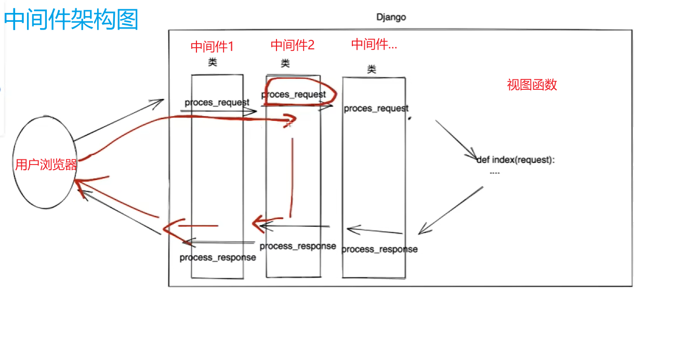
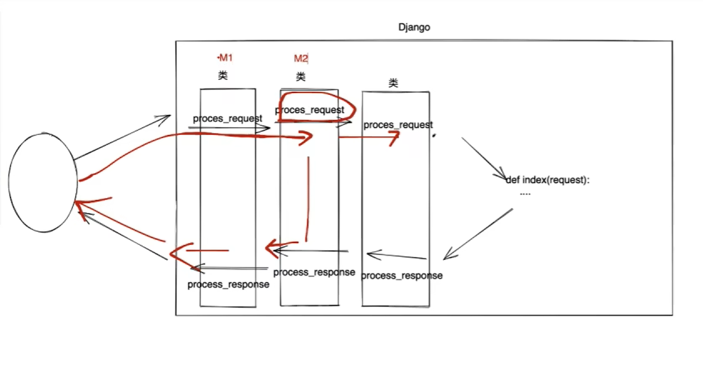

# 中间件

## 1. 架构图

中间件可以有很多层..

- 这里用中间件解决的问题为：
- 如果给每一个视图函数加上

        info = request.session.get('info')  # 获取 Session_data 的数据
        if not info:
           return redirect("/login/")

- 这样判断用户是否登录而决定否要跳转的方法，太过繁琐

* 引入中间件 

* 进入中间件 顺序进入  某一层被拦截了 就在某一层依次退出返回到浏览器

M1.process_request
M2.process_request
[22/Jul/2025 16:56:30] "GET /depart/list/ HTTP/1.1" 200 10668
M2.process_response
M1.process_response