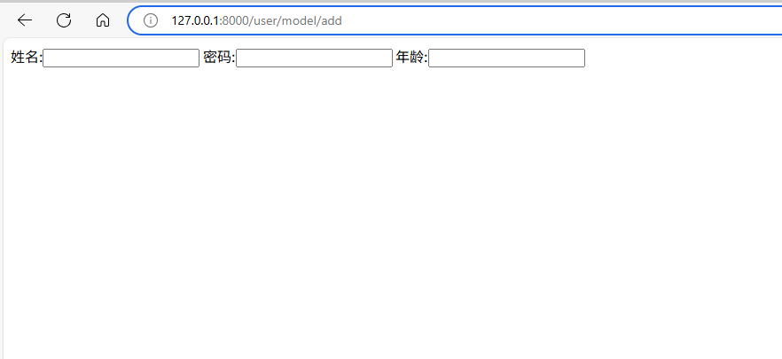
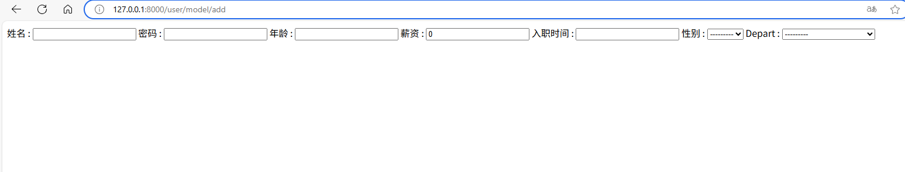
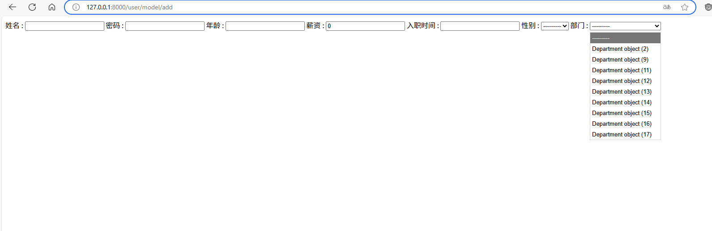
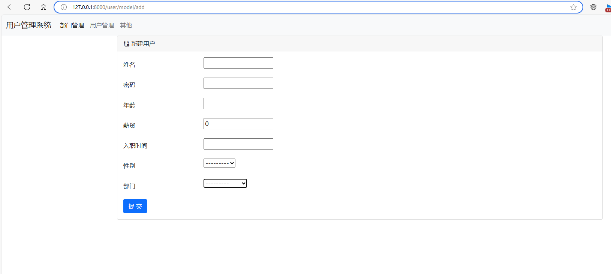
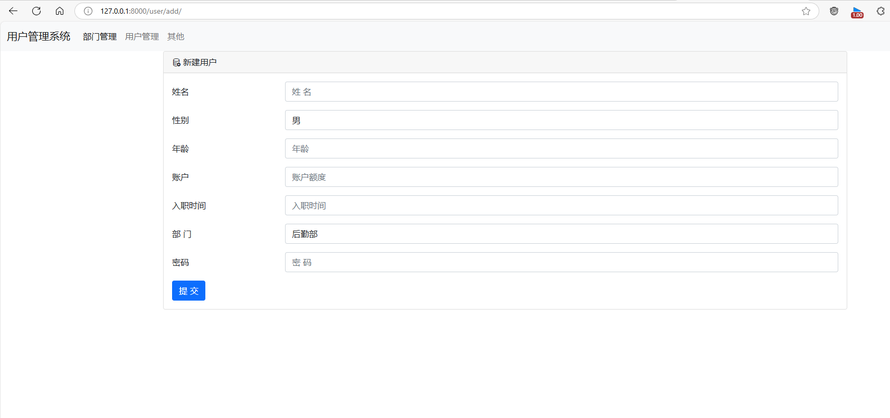

# modelform组件

## 1. 定义ModelForm

```python
# models.py

from django.db import models


class UserInfo(models.Model):
    """ 员工信息表 """
    name = models.CharField(verbose_name="姓名", max_length=16)
    password = models.CharField(verbose_name="密码", max_length=64)
    age = models.IntegerField(verbose_name="年龄")
    salary = models.DecimalField(verbose_name="薪资", max_digits=10, decimal_places=2, default=0)
    create_time = models.DateTimeField(verbose_name="入职时间")

    sex_choice = (
        (1, "男"),
        (0, "女"),
    )
    sex = models.SmallIntegerField(verbose_name="性别", choices=sex_choice)
    depart = models.ForeignKey(to="Department", to_field="id", on_delete=models.CASCADE)
```

```python
# views.py

from django import forms
from app02 import models
from django.shortcuts import render

class UserModelForm(forms.ModelForm):
    class Meta:
        model = models.UserInfo
        #fields = ["name","age","password"] 也可以仅调用需要的字段
        fields = "__all__"
        
def user_model_add(request):
    form = UserModelForm()
    return render(request, "user_model_add.html", {"form":form})

# 通过{"form":form}传过去后,可以通过
#     {{ form.name.label }}:{{ form.name }}
#     {{ form.password.label }}:{{ form.password }}
#     {{ form.age.label }}:{{ form.age }}

# 画出input框,其中带有label为标签名,即verbose名
```

```html
<!--user_model_add.html-->

模板文件调用方法: 
    {{ form.name.label }}:{{ form.name }}
    {{ form.password.label }}:{{ form.password }}
    {{ form.age.label }}:{{ form.age }}

```

### 模板文件调用说明

```views.py
def user_model_add(request):
    form = UserModelForm()
    return render(request, "user_model_add.html", {"form":form})

```


视图函数user_model_add传了很多参数方法给user_model_add.html
* 其中{"form":form}就是把前面定义的form = UserModelForm()这个类传给user_model_add.html
*  user_model_add.html就可以调用
* 方法:
>> {{ form.name }}绘制带有name字段属性的input框 ,可以直接接受,具有原始方法的一切属性 
>> {{ form.name.label }} 带有label表示注释
* label的值为model.py中对应数据表的name字段中的verbose说明标签属性,
> name = models.CharField(verbose_name="姓名", max_length=16)其中的verbose是什么input框前面就显示什么
> 
> 
具体效果如果:


## 2. 全部定义的简便方法,省却重复操作

```html
<!--user_model_add.html-->

模板文件简便调用方法: 
    
    
        {{ field.label }} : {{ field }}  {# 注意拼写label而非lable #}
    

```
效果如图:

这里的部门显示depart字段名,是因为没有写verbose_name标签,写上即可
如图:


## 3. 但是上述图片可以看到, 其中的部门输出的为对象,而非对象下的某个字段值
因为
    
    
        {{ field.label }} : {{ field }}  {# 注意拼写label而非lable #}
    
实际只是执行了
```text
    queryset = [obj,obj,obj...]
    queryset = models.Department.objects.all()
    for obj in queryset:
    print(obj)
```
```python
#等同于
class TianXiWei(object):
    pass

TXW1 = TianXiWei() #实例化一个对象
print(TXW1) #打印对象

# 打印结果如下,也是一个完整对象
#E:\PycharmProjects\dya2\.venv\Scripts\python.exe E:\PycharmProjects\dya2\笔记记录\Django组件\test.py 

# <__main__.TianXiWei object at 0x00000141AC2F5FA0>

# 进程已结束，退出代码为 0


# 要想精确打印对象内的内容需要,使用__str__方法
class TianXiWei(object):
    def __str__(self):
        return "cheng love TXW"

TXW1 = TianXiWei() #实例化一个对象
print(TXW1) #打印对象

# 打印结果为对象内的内容: cheng love TXW
```
> 输出对象时,想要定制对象内的内容,定义一个__str__方法
> 

## 3.实际应用

```html

<form method="post"> <!--  提交后的目的地址 action -->
    

    

    <div class="row mb-3">
        <label for="inputEmail3" class="col-sm-2 col-form-label">{{ field.label }}</label>
        <div class="col-sm-10">

            {{ field }}

        </div>
    </div>

    


    <button type="submit" class="btn btn-primary">提 交</button>
</form>


```

产出效果:


对比原版:


> 引出问题:ModelForm组件引出的样式不一,怎么添加样式

## 3.ModelForm应用的模板文件, 添加样式

### 1. 这里以input框为例,添加样式方法 ( 添加widgets插件 )

```python
from django import forms
from app02 import models

class UserModelForm(forms.ModelForm):
    class Meta:
        model = models.UserInfo
        fields = "__all__" #取UserInfo数据表定义的全部字段
        # fields = ["name","age","password"]
        
        widgets = {
            "name":forms.TextInput(attrs={"class":"form-control"}),
            "password": forms.TextInput(attrs={"class": "form-control"}),
            "age": forms.TextInput(attrs={"class": "form-control"}),
        }
```
        
        widgets = {
            "name":forms.TextInput(attrs={"class":"form-control"}),
            "password": forms.TextInput(attrs={"class": "form-control"}),
            "age": forms.TextInput(attrs={"class": "form-control"}),
            .....
        }
在类里面给每个input框添加样式也能实现但是繁琐

### 2.ModelForm添加样式,实际生产采用方式

```python

from django import forms
from app02 import models

class UserModelForm(forms.ModelForm):
    class Meta:
        model = models.UserInfo
        fields = "__all__" #取UserInfo数据表定义的全部字段
    def __init__(self,*args,**kwargs):
        super().__init__(*args,**kwargs) # super()继承父类

        #循环找到所有插件,添加 样式
        for name, field in self.fields.items():
            
             # 某个字段不想加样式 (一直循环进来判断,条件成立,continue直接 跳转到for循环,而不执行后续的)
             
             # 这里例如 create_time字段不想加样式
             
             if name == "create_time":
                continue

            # field.widget.attrs["class"] = "form-control" 
            field.widget.attrs={"class":"form-control"}
```

## 4. Modelform组件的校验使用方法

### 1. 关闭浏览器校验

> 下面表单在为空值时,浏览器会提示请输入此字段,需要关闭浏览器校验,使用Django校验
```html

<form method="post"> <!--  提交后的目的地址 action -->
    

    

    <div class="row mb-3">
        <label for="inputEmail3" class="col-sm-2 col-form-label">{{ field.label }}</label>
        <div class="col-sm-10">

            {{ field }}

        </div>
    </div>

    
```
### 2. 浏览器校验关闭方法----novalidate

```html

<form method="post" novalidate> <!--  提交后的目的地址 action -->
    

    

    <div class="row mb-3">
        <label for="inputEmail3" class="col-sm-2 col-form-label">{{ field.label }}</label>
        <div class="col-sm-10">

            {{ field }}

        </div>
    </div>

    
```
### 3.ModelForm错误校验添加

```html

<form method="post" novalidate> <!--  提交后的目的地址 action -->
    

    

    <div class="row mb-3">
        <label for="inputEmail3" class="col-sm-2 col-form-label">{{ field.label }}</label>
        <div class="col-sm-10">

            {{ field }}
            {{ field.errors.0 }} 在字段下方显示错误信息,不止一个,0取第一个错误
            
        </div>
    </div>

    
```

### 4. 编辑页面的输入框的默认值设置

```python
from app02 import models
from django import forms
from django.shortcuts import render,redirect

class UserModelForm(forms.ModelForm):

    class Meta:
        model = models.UserInfo
        fields = "__all__" 
    
def user_edit(request, nid):

   
    # 1.设置辑页面input框内默认值----（在input框设置value参数即为默认值）
    row_list = models.UserInfo.objects.filter(id=nid).first() #(对象)

    form = UserModelForm(instance=row_list)
    return render(request, "user_edit.html", {"form":form})
```
> 传入默认值方法

>> row_list = models.UserInfo.objects.filter(id=nid).first() #(对象)

>> form = UserModelForm(instance=row_list)