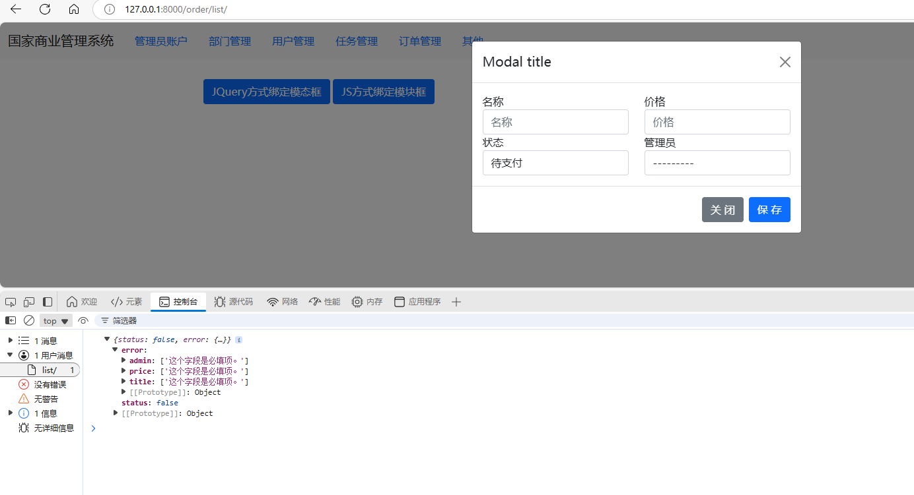
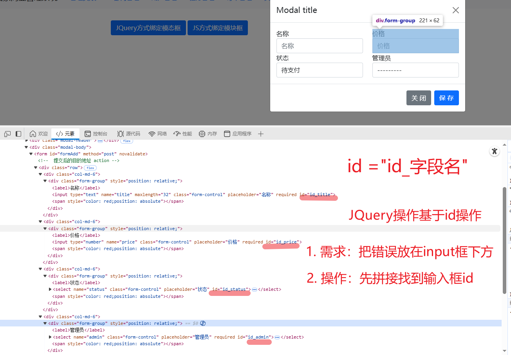
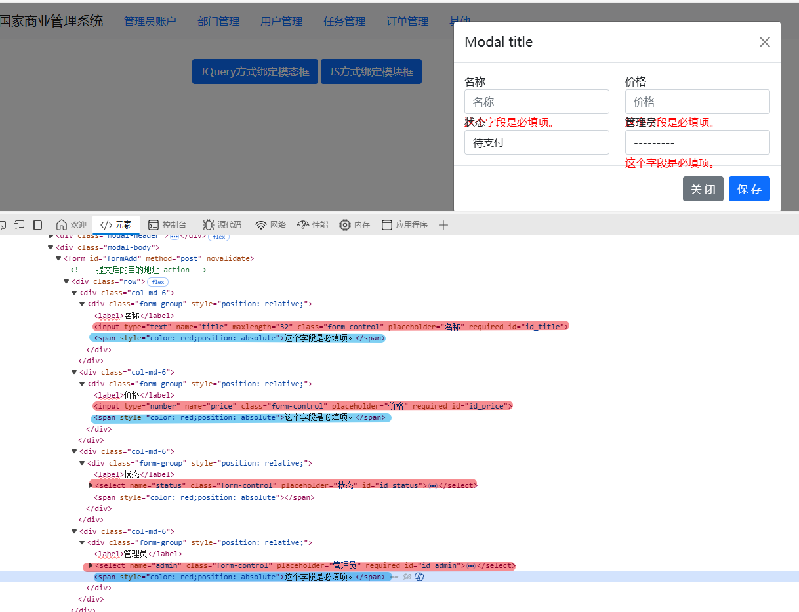

# 难点

## 1. 

```js
        function bindBtnSaveEvent() {
    $("#btnSave").click(function () {

        $.ajax({
            url: "/order/add/",
            type: "POST",
            data: $("#formAdd").serialize(),
            dataType: "json",
            success: function (res) {
                if (res.status) {
                    alert("添加成功");
                } else {
                    // 把错误信息显示在对话框中
                    $.each(res.error, function (name, errorList) {
                        $("#id_" + name).next().text(errorList[0]);
                    })
                }
            }
        });
    })
}


```

## 2. 把错误信息显示在对话框中---难点

查看控制台错误信息如下：


* .each 循环
* res.error返回的错误信息
* name,errorList 
* 字段名，错误列表（每个字段有多个错误--组成列表--通常取errorList[0]---也就是第一个）为：
admin:['这个字段是必填项。']
price:['这个字段是必填项。']
title:['这个字段是必填项。']
$.each(res.error, function (name, errorList) {
    $("#id_" + name).next().text(errorList[0]);
})
}

* 如图
* 解释了这串代码
$.each(res.error, function (name, errorList) {
    $("#id_" + name).next().text(errorList[0]);
})
}

* 其中next()表示取到错误标签，错误标签在input框的下一个
* 错误列表/errorList
* （每个字段有多个错误--组成列表--通常取errorList[0]---也就是第一个）
