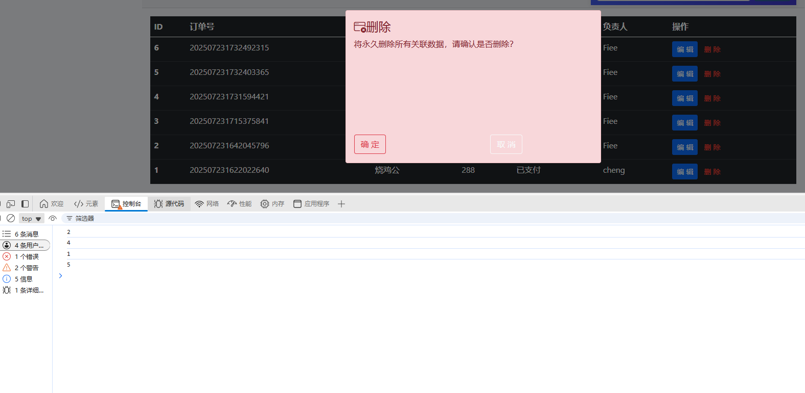

# 删除

## 1. 点击按钮删除当前列

* 给删除按钮加入属性
  删除按钮自定义属性： uid="{{ obj.id }}"
* JS代码获取当前列id：
  var uid = $(this).attr("uid")
                
* 打印结果 console.log(uid) 如下图：

## 2.
<tr uid="{{ obj.id }}">
                        <th scope="col">ID</th>
                        <th scope="col">订单号</th>
                        <th scope="col">订单名称</th>
                        <th scope="col">价格</th>
                        <th scope="col">订单状态</th>
                        <th scope="col">负责人</th>
                        <th scope="col">操作</th>
</tr>

