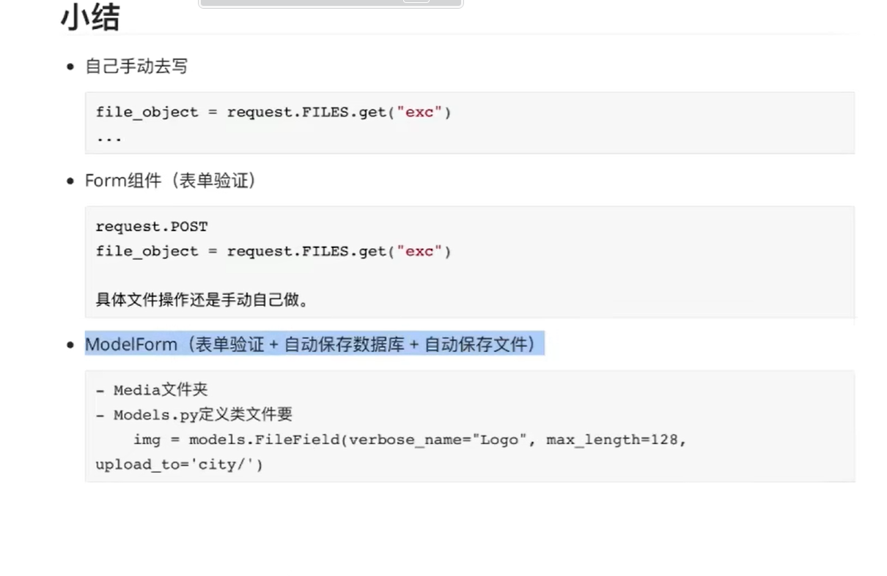

# Django目录结构

## 1.两个特殊的文件夹
* static 
存放静态文件的路径，包括：css,js,项目图片.
* media
用户上传的数据的目录。

## 2. 启用media目录

* urls.py

from django.urls import path,re_path
from django.views.static import serve
from django.conf import settings

urlpatterns = [
    re_path(r'^media/(?P<path>.*)$',serve,{'document_root': settings.MEDIA_ROOT}, name='media'),
]

* setting.py

import os
MEDIA_ROOT = os.path.join(BASE_DIR, "media")
MEDIA_URL = '/media/'

* 配置完即可访问此地址/media/下的内容
> http://127.0.0.1:8000/media/f1.png

## 3. 总结
具体如图：
