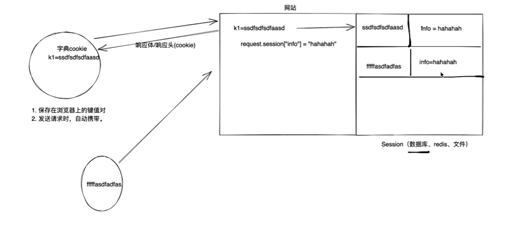

## 1.流程

Django写入：

request.session["info"] ="hello Session"

左边用户浏览器请求的时候，携带字符串

登录成功后，将"hello Session"存入Session

---

具体Session存储在网站中的结构：

    Session_id                   +  session_data存入的值
左边用户请求携带字符串               +  "hello Session"
（f12 》 网络 》cookies 可查看）        一般存入用户名 等动态信息

---

> Session_id 浏览器存在 （f12 》 网络 》cookies 可查看）中
> 服务端 Django存储在数据库中，Django默认创建一个django_session表
>> django_session表
> session_key   session_data   expire_date 3个字段
> 浏览器存储字段   存入的用户名等信息