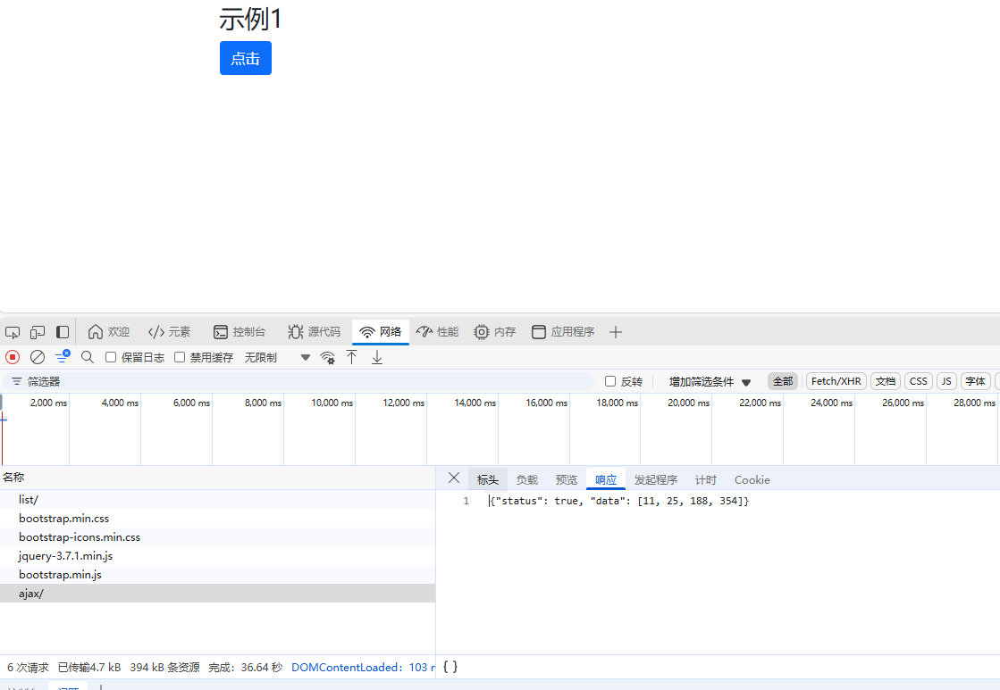
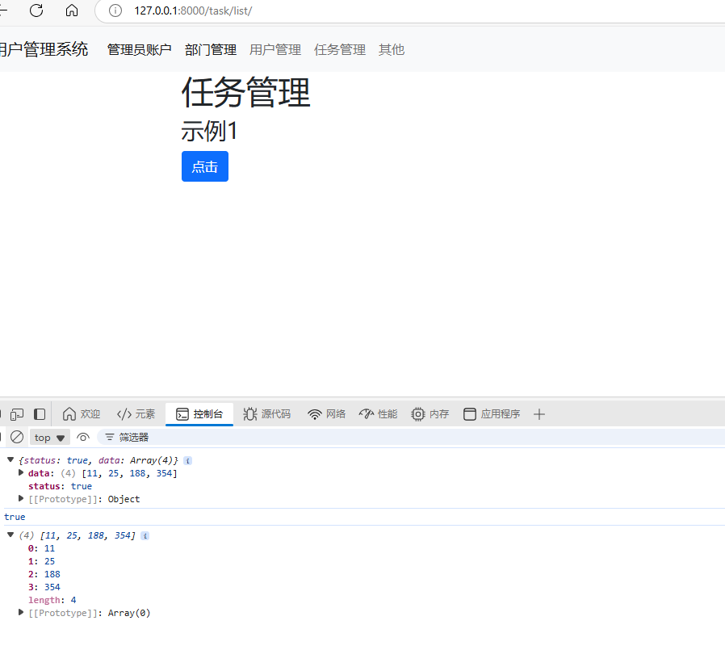
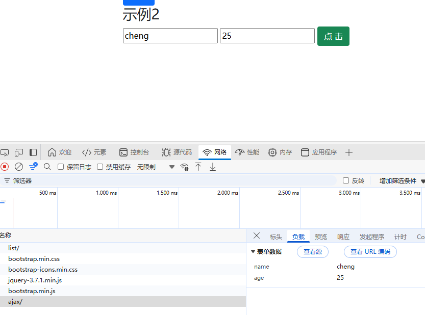
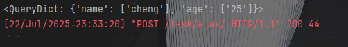
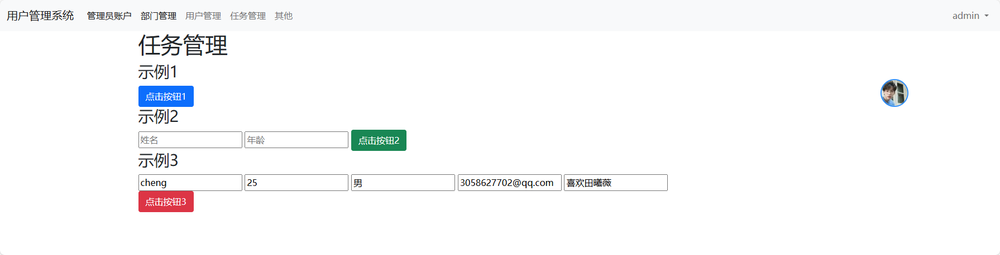
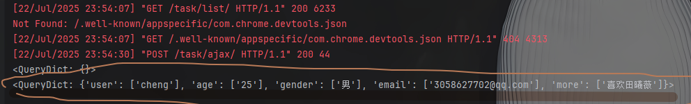

# Ajax请求

## 1. 概述

浏览器向网站发送请求时，URL 和 表单形式提交。
* GET
* POST
特点： 页面刷新

除此之外，也可以基于Ajax向后台发送请求（偷偷的发送请求）----页面不会刷新

## 2. Ajax

* 以来JQuery
* 编写ajax代码
* 
> 绑定方法---onclick点击事件绑定
>   <input type="button" class="btn btn-primary" value="点击" onclick="clickMe();">

### 1. ajax 发送GET请求


```js
$.ajax({
    url:"发送的地址",
    type:"get",
    data:{
        n1:123,
        n2:456
    },
    success:function (res){
        console.log(res);
    }
})
```
```python
from django.http import HttpResponse

def task_ajax(request):
    print(request.GET)
    return HttpResponse("成功了")
```

### 2. ajax 发送POST请求
```js
$.ajax({
    url:"发送的地址",
    type:"post",
    data:{
        n1:123,
        n2:456
    },
    success:function (res){
        console.log(res);
    }
})
```
```python
from django.http import HttpResponse
from django.views.decorators.csrf import csrf_exempt # 免除csrf_token认证


@csrf_exempt # 免除csrf_token认证
def task_ajax(request):
    print(request.GET)
    print(request.POST)
    return HttpResponse("成功了")
```

### 3. JQuery方法绑定---通过id绑定
> <input id="btn1" type="button" class="btn btn-primary" value="点击"">
```js

   $(function() {
            // 页面框架加载完成后自动执行下面的函数
            bindBtn1Event();
        })
        function bindBtn1Event() {
            // 函数内部先找到btn1这个按钮，然后绑定一个事件--click点击这个事件后，执行内部代码
            $("#btn1").click(function() {
                 $.ajax({
                url: '/task/ajax/',
                type: "post",
                data: {
                    n1: 123,
                    n2: 456
                },
                success:function(res){
                    console.log(res);
                }
            })
            })
        }
```

### 4.总结

    <script type="text/javascript">
        {# 2. JQuery方式绑定#}
        $(function() {
            // 页面框架加载完成后自动执行下面的函数
            bindBtn1Event();
        })
        function bindBtn1Event() {
            // 函数内部先找到btn1这个按钮，然后绑定一个事件--click点击这个事件后，执行内部代码
            $("#btn1").click(function() {
                 $.ajax({
                url: '/task/ajax/',
                type: "post",
                data: {
                    n1: 123,
                    n2: 456
                },
                success:function(res){
                    console.log(res);
                }
            })
            })
        }

        {# 1. DOM方式绑定#}
        function clickMe() {
            {#console.log('点击了按钮');#}
             $.ajax({
                url: '/task/ajax/',
                type: "post",
                data: {
                    n1: 123,
                    n2: 456
                },
                success:function(res){
                    console.log(res);
                }
            })
        }
    </script>

## 3.ajax请求的返回值
* 一般返回JSON格式

* python的语法如下
```python 
import json

from django.http import HttpResponse, JsonResponse
from django.views.decorators.csrf import csrf_exempt  # 免除csrf_token认证


@csrf_exempt
def task_ajax(request):
    print(request.GET)
    print(request.POST)
    data_dict = {"status": True, 'data': [11, 25, 188, 354]}
    json_string = json.dumps(data_dict)
    return HttpResponse(json_string)
   
```
响应格式：


* Django提供的方法如下

```python
from django.http import HttpResponse, JsonResponse
from django.views.decorators.csrf import csrf_exempt  # 免除csrf_token认证
from django.http import JsonResponse

@csrf_exempt
def task_ajax(request):
    print(request.GET)
    print(request.POST)
    data_dict = {"status": True, 'data': [11, 25, 188, 354]}
    return JsonResponse(data_dict)

   
```
## 4.前端json--转--对象
*  dataType: 'json',-----json 转 对象
*  打印内部的每个对象下的内容：
*    console.log(res.status); 
*    console.log(res.data);


```js
   function clickMe() {
            {#console.log('点击了按钮');#}
             $.ajax({
                url: '/task/ajax/',
                type: "post",
                data: {
                    n1: 123,
                    n2: 456
                },
                 dataType: 'json',
                success:function(res){
                    console.log(res);
                    console.log(res.status);
                    console.log(res.data);
                }
            })
        }
```
单个对象如图：


## 5. ajax传送前端数据到后台 (少量数据)

>      <h3>示例2</h3>
        <input type="text" id="txtUser" placeholder="姓名">
        <input type="text" id="txtAge" placeholder="年龄">
        <input type="button" id="btn2" class="btn btn-success" value="点 击">
    
```js

// {#示例2：将inpt输入框内的内容传到后台，传到django后台#}
        function bindBtn2Event() {
            // 函数内部先找到btn1这个按钮，然后绑定一个事件--click点击这个事件后，执行内部代码
            $("#btn2").click(function() {
                 $.ajax({
                url: '/task/ajax/',
                type: "post",
                data: {
                    name:$("#txtUser").val(),
                    age:$("#txtAge").val(),
                },
                dataType: 'json',
                success:function(res){
                    console.log(res);
                    console.log(res.status);
                    console.log(res.data);
                }
            })
            })
        }
```
* 前端输入如图：


* 后台接受如图


## 6. ajax 前端数据--传到--后台（大量输入框）

     <h3>示例3</h3>
        <form id="form3">
            <input type="text" name="user" placeholder="姓名">
            <input type="text" name="age" placeholder="年龄">
            <input type="text" name="gender" placeholder="性别">
            <input type="text" name="email" placeholder="邮箱">
            <input type="text" name="more" placeholder="介绍">
        </form>
        <input id="btn3" type="button" class="btn btn-danger" value="点击按钮3">
   
```js
       {#示例3 ：多输入框传到后台   #}
        function bindBtn3Event() {
            // 函数内部先找到btn1这个按钮，然后绑定一个事件--click点击这个事件后，执行内部代码
            $("#btn3").click(function () {
                $.ajax({
                    url: '/task/ajax/',
                    type: "post",
                    data: $("#form3").serialize(),
                    dataType: 'json',
                    success: function (res) {
                        console.log(res);
                        console.log(res.status);
                        console.log(res.data);
                    }
                })
            })
        }
```
前端如图：

后端如图：


这样即可批量获取到input框的内容